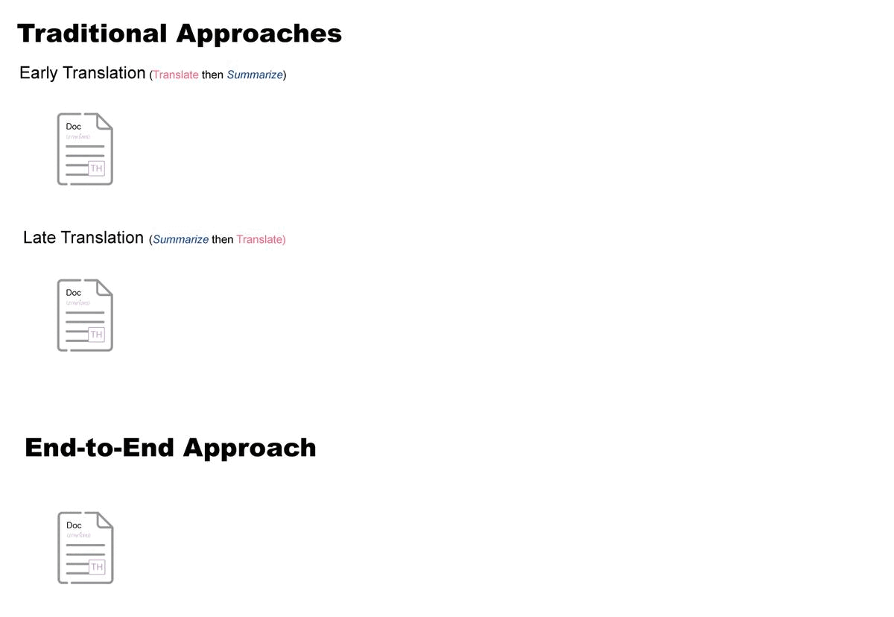
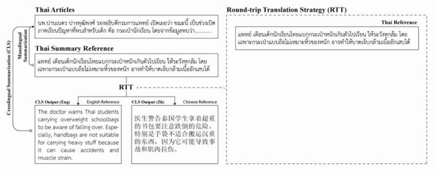

<h1 id="title"> Th2En & Th2Zh: The large-scale datasets for Thai text cross-lingual summarization</h1>


📥 Download [Datasets](#dataset-statistic) <br>
📥 Download [Trained Models](#trained-models)
---

<h2 id="introduction"> INTRODUCTION </h2>
TH2ZH (Thai-to-Simplified Chinese) and TH2EN (Thai-to-English) are cross-lingual summarization (CLS) datasets. The source articles of these datasets are from TR-TPBS dataset, a monolingual Thai text summarization dataset. To create CLS dataset out of TR-TPBS, we used a neural machine translation service to translate articles into target languages. For some reasons, we were strongly recommended not to mention the name of the service that we used 🥺. We will refer to the service we used as ‘main translation service’.

Cross-lingual summarization (cross-sum) is a task to summarize a given document written in one language to another language short summary.



Traditional cross-sum approaches are based on two techniques namely early translation technique and late translation technique. Early translation can be explained easily as translate-then-summarize method. Late translation, in reverse, is summarize-then-translate method.

However, classical cross-sum methods tend to carry errors from monolingual summarization process or translation process to final cross-language output summary. Several end-to-end approaches have been proposed to tackle problems of traditional ones. Couple of end-to-end models are available to download as well.

<h3 id="dataset-construction"> DATASET CONSTRUCTION</h3>

<b>**💡<u>Important Note**</u></b> <i>In contrast to  Zhu, et al, in our experiment, we found that filtering out articles using RTT technique worsen the overall performance of the end-to-end models significantly. Therefore, full datasets are highly recommended.</i>

We used [TR-TPBS](https://github.com/nakhunchumpolsathien/TR-TPBS) as source documents for creating cross-lingual summarization dataset. In the same way as [Zhu, et al.](https://arxiv.org/abs/1909.00156), we constructed Th2En and Th2Zh by translating the summary references into target languages using translation service and filtered out those poorly-translated summaries using round-trip translation technique (RTT). The overview of cross-lingual summarization dataset construction is presented in belowe figure. Please refer to the [corresponding paper](https://arxiv.org/abs/1909.00156) for more details on RTT.


In our experiment, we set 𝑇1 and 𝑇2 equal to 0.45 and 0.2 respectively, backtranslation technique filtered out 27.98% from Th2En and 56.79% documents from Th2Zh.

```
python3 src/tools/cls_dataset_construction.py \
--dataset th2en \
--input_csv path/to/full_dataset.csv \
--output_csv path/to/save/filtered_csv \
--r1 0.45 \
--r2 0.2
```

* `--dataset` can be {`th2en`, `th2zh`}.
* `--r1` and `--r2` are where you can set ROUGE score thresholds (r1 and r2 represent ROUGE-1 and ROUGE-2 respectively) for filtering (assumingly) poor translated articles.

<h3 id="dataset-statistic">Dataset Statistic</h3>

Click the file name to download.

| File         | Number of Articles | Size    |
| ---------------- | -------------------- | --------- |
|[th2en_full.csv](https://docs.google.com/forms/d/e/1FAIpQLSeZ5dnJKpuoe7a2SsU9QKAaPEFPm5uZukw5RyTdilsUFTe9Rw/viewform?usp=sf_link) | 310,926            | 2.96 GB |
|[th2zh_full.csv](https://docs.google.com/forms/d/e/1FAIpQLScxpmxfPVhkyO3gCZRC8kO3jbQtjlUSPUcUjUzY3r7Jyx8QOA/viewform?usp=sf_link) | 310,926            | 2.81 GB |
|[testset.csv](https://bit.ly/thcls_test)    | 3,000              | 44 MB   |
|[validation.csv](https://bit.ly/thcls_validation) | 3,000              | 43 MB   |

<h3 id="data-fields">Data Fields</h3>

Please refer to [th2enzh_data_exploration.ipynb](th2enzh_data_exploration.ipynb) for more details.


| Column           | Description                                |
| ------------------ | -------------------------------------------- |
| `th_body`        | Original Thai body text                    |
| `th_sum`         | Original Thai summary                      |
| `th_title`       | Original Thai Article headline             |
| `{en/zh}_body`   | Translated body text                       |
| `{en/zh}_sum`    | Translated summary                         |
| `{en/zh}_title`  | Translated article's headline              |
| `{en/zh}2th`     | Back translation of`{en/zh}_body`          |
| `{en/zh}_gg_sum` | Translated summary (by Google Translation) |
| `url`            | URL to original article’s webpage         |

* `{th/en/zh}_title` are only available in test set.
* `{en/zh}_gg_sum` are also only available in test set. We (at the time this experiment took place) assumed that Google translation was better than the main translation service we were using. We intended to use these Google translated summaries as some kind of alternative summary references, but in the end, they never been used. We decided to make them available in the test set anyway, just in case the others find them useful.
* `{en/zh}_body` were not presented during training end-to-end models. They were used only in early translation methods.

<h2 id="trained-models">AVAILABLE TRAINED MODELS</h2>
<table>
<thead>
  <tr>
    <th rowspan="2">Model</th>
    <th rowspan="2">Corresponding Paper</th>
    <th colspan="2">Thai -&gt; English</th>
    <th colspan="2">Thai -&gt; Simplified Chinese</th>
  </tr>
  <tr>
    <th>Full</th>
    <th>Filtered</th>
    <th>Full</th>
    <th>Filtered</th>
  </tr>
</thead>
<tbody>
  <tr>
    <td>TNCLS</td>
    <td><a href="https://arxiv.org/pdf/1909.00156.pdf">Zhu et al., 2019</a></td>
    <td><a href="https://nakhun-chumpolsathien.oss-us-west-1.aliyuncs.com/th_cls/models/ncls_base_th2en-full-20230204T131638Z-001.zip">Available</a></td>
    <td><center>-</center></td>
    <td><center>-</center></td>
    <td><center>-</center></td>

  </tr>
  <tr>
    <td>CLS+MS</td>
    <td><a href="https://arxiv.org/pdf/1909.00156.pdf">Zhu et al., 2019</a></td>
    <td><span style="font-weight:400;font-style:normal"><a href="https://nakhun-chumpolsathien.oss-us-west-1.aliyuncs.com/th_cls/models/ncls_2task_eng_full-20230204T122728Z-001.zip">Available</a></span></td>
    <td><center>-</center></td>
    <td><center>-</center></td>
    <td><center>-</center></td>
  </tr>
  <tr>
    <td>CLS+MT</td>
    <td><a href="https://arxiv.org/pdf/1909.00156.pdf">Zhu et al., 2019</a></td>
    <td><span style="font-weight:400;font-style:normal"><a href="https://nakhun-chumpolsathien.oss-us-west-1.aliyuncs.com/th_cls/models/ncls_2tasm%2B_en_full-20230204T123000Z-001.zip">Available</a></span></td>
    <td><center>-</center></td>
    <td><a style="font-weight:400;font-style:normal"><a href="https://nakhun-chumpolsathien.oss-us-west-1.aliyuncs.com/th_cls/models/ncls_2task%2B_full-20230204T123205Z-001.zip">Available</a></span></td>
    <td><center>-</center></td>
  </tr>
  <tr>
    <td>XLS – RL-ROUGE</td>
    <td><a href="https://arxiv.org/pdf/2006.15454.pdf">Dou et al., 2020</a></td>
    <td><span style="font-weight:400;font-style:normal"><a href="https://nakhun-chumpolsathien.oss-us-west-1.aliyuncs.com/th_cls/models/full-dataset-20230204T123032Z-001.zip">Available</a></span></td>
    <td><center>-</center></td>
    <td><span style="font-weight:400;font-style:normal"><a href="https://nakhun-chumpolsathien.oss-us-west-1.aliyuncs.com/th_cls/models/th2zh-full-20230204T123022Z-001.zip">Available</a></span></td>
    <td><center>-</center></td>
  </tr>
</tbody>
</table>

To evaluate these trained models, please refer to [xls_model_evaluation.ipynb](xls_model_evaluation.ipynb) and [ncls_model_evaluation.ipynb](ncls_model_evaluation.ipynb).


If you wish to evaluate the models with our test sets, you can use below script to create test files for XLS and NCLS models.
```
python3 src/tools/create_cls_test_manifest.py \
--test_csv_path path/to/testset.csv \
--output_dir path/to/save/testset_files \
--use_google_sum {true/false} \
--max_tokens 500 \
--create_ms_ref {true/false}
```
* `output_dir` is path to directory that you want to save test set files
* `use_google_sum` can be {`true`/`false`}. If `true`, it will select summary reference from columns `{en/zh}_gg_sum`. Default is `false`.
* `max_tokens` number of maximum words in input articles. Default is `500` words. Too short or too long articles can significantly worsen performance of the models.
* `create_ms_ref` whether to create Thai summary reference file to evaluate MS task in NCLS:CLS+MS model.

This script will produce three files namely test.CLS.source.thai.txt and test.CLS.target.{en/zh}.txt. test.CLS.source.thai.txt is used as a test file for cls task. test.CLS.target.{en/zh}.txt are the crosslingual summary reference for English and Chinese, they are used to evaluate ROUGE and BertScore. Each line is corresponding to the body articles in test.CLS.source.thai.txt.

🥳 We also evaluated MT tasks in XLS and NCLS:CLS+MT models. Please refers to [xls_model_evaluation.ipynb](xls_model_evaluation.ipynb) and [ncls_model_evaluation.ipynb](ncls_model_evaluation.ipynb) for BLUE score results . For test sets that we used to evaluate MT task, please refer to [data/README.md](data/README.md).

<h2 id="EXPERIMENT-RESULTS">EXPERIMENT RESULTS</h2>
🔆 It has to be noted that all of end-to-end models reported in this section were trained on filtered datasets NOT full datasets. And for all end-to-end models, only `th_body` and `{en/zh}_sum` were present during training. We trained end-to-end models for 1,000,000 steps and selected model checkpoints that yielded the highest overall ROUGE scores to report the experiment. 

In this experiment, we used two automatic evaluation matrices namely [ROUGE](https://pypi.org/project/rouge/1.0.0/) and [BertScore](https://github.com/Tiiiger/bert_score) to assess the performance of CLS models. We evaluated ROUGE on Chinese text at word-level, NOT character level. 

We only reported BertScore on abstractive summarization models. To evaluate the results with BertScore we used weights from ‘roberta-large’ and ‘bert-base-chinese’ pretrained models for Th2En and Th2Zh respectively. 

<table style="border-collapse:collapse;border-spacing:0" class="tg"><thead><tr><th style="border-color:inherit;border-style:solid;border-width:1px;font-family:Arial, sans-serif;font-size:14px;font-weight:normal;overflow:hidden;padding:10px 5px;text-align:center;vertical-align:top;word-break:normal" rowspan="3">Model</th><th style="border-color:inherit;border-style:solid;border-width:1px;font-family:Arial, sans-serif;font-size:14px;font-weight:bold;overflow:hidden;padding:10px 5px;text-align:center;vertical-align:top;word-break:normal" colspan="4">Thai to English</th><th style="border-color:inherit;border-style:solid;border-width:1px;font-family:Arial, sans-serif;font-size:14px;font-weight:bold;overflow:hidden;padding:10px 5px;text-align:center;vertical-align:top;word-break:normal" colspan="4">Thai to Chinese</th></tr><tr><th style="border-color:inherit;border-style:solid;border-width:1px;font-family:Arial, sans-serif;font-size:14px;font-weight:normal;overflow:hidden;padding:10px 5px;text-align:center;vertical-align:top;word-break:normal" colspan="3">ROUGE</th><th style="border-color:inherit;border-style:solid;border-width:1px;font-family:Arial, sans-serif;font-size:14px;font-weight:normal;overflow:hidden;padding:10px 5px;text-align:center;vertical-align:top;word-break:normal">BertScore</th><th style="border-color:inherit;border-style:solid;border-width:1px;font-family:Arial, sans-serif;font-size:14px;font-weight:normal;overflow:hidden;padding:10px 5px;text-align:center;vertical-align:top;word-break:normal" colspan="3"><span style="font-weight:400;font-style:normal">ROUGE</span></th><th style="border-color:inherit;border-style:solid;border-width:1px;font-family:Arial, sans-serif;font-size:14px;font-weight:normal;overflow:hidden;padding:10px 5px;text-align:center;vertical-align:top;word-break:normal"><span style="font-weight:400;font-style:normal">BertScore</span></th></tr><tr><th style="border-color:inherit;border-style:solid;border-width:1px;font-family:Arial, sans-serif;font-size:14px;font-weight:normal;overflow:hidden;padding:10px 5px;text-align:center;vertical-align:top;word-break:normal">R1</th><th style="border-color:inherit;border-style:solid;border-width:1px;font-family:Arial, sans-serif;font-size:14px;font-weight:normal;overflow:hidden;padding:10px 5px;text-align:center;vertical-align:top;word-break:normal">R2</th><th style="border-color:inherit;border-style:solid;border-width:1px;font-family:Arial, sans-serif;font-size:14px;font-weight:normal;overflow:hidden;padding:10px 5px;text-align:center;vertical-align:top;word-break:normal">RL</th><th style="border-color:inherit;border-style:solid;border-width:1px;font-family:Arial, sans-serif;font-size:14px;font-weight:normal;overflow:hidden;padding:10px 5px;text-align:center;vertical-align:top;word-break:normal">F1</th><th style="border-color:inherit;border-style:solid;border-width:1px;font-family:Arial, sans-serif;font-size:14px;font-weight:normal;overflow:hidden;padding:10px 5px;text-align:center;vertical-align:top;word-break:normal">R1</th><th style="border-color:inherit;border-style:solid;border-width:1px;font-family:Arial, sans-serif;font-size:14px;font-weight:normal;overflow:hidden;padding:10px 5px;text-align:center;vertical-align:top;word-break:normal">R2</th><th style="border-color:inherit;border-style:solid;border-width:1px;font-family:Arial, sans-serif;font-size:14px;font-weight:normal;overflow:hidden;padding:10px 5px;text-align:center;vertical-align:top;word-break:normal">RL</th><th style="border-color:inherit;border-style:solid;border-width:1px;font-family:Arial, sans-serif;font-size:14px;font-weight:normal;overflow:hidden;padding:10px 5px;text-align:center;vertical-align:top;word-break:normal">F1</th></tr></thead><tbody><tr><td style="border-color:inherit;border-style:solid;border-width:1px;font-family:Arial, sans-serif;font-size:14px;font-style:italic;overflow:hidden;padding:10px 5px;text-align:left;vertical-align:top;word-break:normal" colspan="9">Traditional Approaches</td></tr><tr><td style="border-color:inherit;border-style:solid;border-width:1px;font-family:Arial, sans-serif;font-size:14px;overflow:hidden;padding:10px 5px;text-align:left;vertical-align:top;word-break:normal">Translated Headline</td><td style="border-color:inherit;border-style:solid;border-width:1px;font-family:Arial, sans-serif;font-size:14px;overflow:hidden;padding:10px 5px;text-align:center;vertical-align:top;word-break:normal">23.44</td><td style="border-color:inherit;border-style:solid;border-width:1px;font-family:Arial, sans-serif;font-size:14px;overflow:hidden;padding:10px 5px;text-align:center;vertical-align:top;word-break:normal">6.99</td><td style="border-color:inherit;border-style:solid;border-width:1px;font-family:Arial, sans-serif;font-size:14px;overflow:hidden;padding:10px 5px;text-align:center;vertical-align:top;word-break:normal">21.49</td><td style="border-color:inherit;border-style:solid;border-width:1px;font-family:Arial, sans-serif;font-size:14px;overflow:hidden;padding:10px 5px;text-align:center;vertical-align:top;word-break:normal">-</td><td style="border-color:inherit;border-style:solid;border-width:1px;font-family:Arial, sans-serif;font-size:14px;overflow:hidden;padding:10px 5px;text-align:center;vertical-align:top;word-break:normal">21.55</td><td style="border-color:inherit;border-style:solid;border-width:1px;font-family:Arial, sans-serif;font-size:14px;overflow:hidden;padding:10px 5px;text-align:center;vertical-align:top;word-break:normal">4.66</td><td style="border-color:inherit;border-style:solid;border-width:1px;font-family:Arial, sans-serif;font-size:14px;overflow:hidden;padding:10px 5px;text-align:center;vertical-align:top;word-break:normal">18.58</td><td style="border-color:inherit;border-style:solid;border-width:1px;font-family:Arial, sans-serif;font-size:14px;overflow:hidden;padding:10px 5px;text-align:center;vertical-align:top;word-break:normal">-</td></tr><tr><td style="border-color:inherit;border-style:solid;border-width:1px;font-family:Arial, sans-serif;font-size:14px;overflow:hidden;padding:10px 5px;text-align:left;vertical-align:top;word-break:normal">ETrans → LEAD2</td><td style="border-color:inherit;border-style:solid;border-width:1px;font-family:Arial, sans-serif;font-size:14px;overflow:hidden;padding:10px 5px;text-align:center;vertical-align:top;word-break:normal">51.96</td><td style="border-color:inherit;border-style:solid;border-width:1px;font-family:Arial, sans-serif;font-size:14px;font-weight:bold;overflow:hidden;padding:10px 5px;text-align:center;vertical-align:top;word-break:normal">42.15</td><td style="border-color:inherit;border-style:solid;border-width:1px;font-family:Arial, sans-serif;font-size:14px;font-weight:bold;overflow:hidden;padding:10px 5px;text-align:center;vertical-align:top;word-break:normal">50.01</td><td style="border-color:inherit;border-style:solid;border-width:1px;font-family:Arial, sans-serif;font-size:14px;overflow:hidden;padding:10px 5px;text-align:center;vertical-align:top;word-break:normal">-</td><td style="border-color:inherit;border-style:solid;border-width:1px;font-family:Arial, sans-serif;font-size:14px;font-weight:bold;overflow:hidden;padding:10px 5px;text-align:center;vertical-align:top;word-break:normal">44.18</td><td style="border-color:inherit;border-style:solid;border-width:1px;font-family:Arial, sans-serif;font-size:14px;overflow:hidden;padding:10px 5px;text-align:center;vertical-align:top;word-break:normal">18.83</td><td style="border-color:inherit;border-style:solid;border-width:1px;font-family:Arial, sans-serif;font-size:14px;font-weight:bold;overflow:hidden;padding:10px 5px;text-align:center;vertical-align:top;word-break:normal">43.84</td><td style="border-color:inherit;border-style:solid;border-width:1px;font-family:Arial, sans-serif;font-size:14px;overflow:hidden;padding:10px 5px;text-align:center;vertical-align:top;word-break:normal">-</td></tr><tr><td style="border-color:inherit;border-style:solid;border-width:1px;font-family:Arial, sans-serif;font-size:14px;overflow:hidden;padding:10px 5px;text-align:left;vertical-align:top;word-break:normal">ETrans → BertSumExt</td><td style="border-color:inherit;border-style:solid;border-width:1px;font-family:Arial, sans-serif;font-size:14px;overflow:hidden;padding:10px 5px;text-align:center;vertical-align:top;word-break:normal">51.85</td><td style="border-color:inherit;border-style:solid;border-width:1px;font-family:Arial, sans-serif;font-size:14px;overflow:hidden;padding:10px 5px;text-align:center;vertical-align:top;word-break:normal">38.09</td><td style="border-color:inherit;border-style:solid;border-width:1px;font-family:Arial, sans-serif;font-size:14px;overflow:hidden;padding:10px 5px;text-align:center;vertical-align:top;word-break:normal">49.50</td><td style="border-color:inherit;border-style:solid;border-width:1px;font-family:Arial, sans-serif;font-size:14px;overflow:hidden;padding:10px 5px;text-align:center;vertical-align:top;word-break:normal">-</td><td style="border-color:inherit;border-style:solid;border-width:1px;font-family:Arial, sans-serif;font-size:14px;overflow:hidden;padding:10px 5px;text-align:center;vertical-align:top;word-break:normal">34.58</td><td style="border-color:inherit;border-style:solid;border-width:1px;font-family:Arial, sans-serif;font-size:14px;overflow:hidden;padding:10px 5px;text-align:center;vertical-align:top;word-break:normal">14.98</td><td style="border-color:inherit;border-style:solid;border-width:1px;font-family:Arial, sans-serif;font-size:14px;overflow:hidden;padding:10px 5px;text-align:center;vertical-align:top;word-break:normal">34.84</td><td style="border-color:inherit;border-style:solid;border-width:1px;font-family:Arial, sans-serif;font-size:14px;overflow:hidden;padding:10px 5px;text-align:center;vertical-align:top;word-break:normal">-</td></tr><tr><td style="border-color:inherit;border-style:solid;border-width:1px;font-family:Arial, sans-serif;font-size:14px;overflow:hidden;padding:10px 5px;text-align:left;vertical-align:top;word-break:normal">ETrans → BertSumExtAbs</td><td style="border-color:inherit;border-style:solid;border-width:1px;font-family:Arial, sans-serif;font-size:14px;font-weight:bold;overflow:hidden;padding:10px 5px;text-align:center;vertical-align:top;word-break:normal">52.63</td><td style="border-color:inherit;border-style:solid;border-width:1px;font-family:Arial, sans-serif;font-size:14px;overflow:hidden;padding:10px 5px;text-align:center;vertical-align:top;word-break:normal">32.19</td><td style="border-color:inherit;border-style:solid;border-width:1px;font-family:Arial, sans-serif;font-size:14px;overflow:hidden;padding:10px 5px;text-align:center;vertical-align:top;word-break:normal">48.14</td><td style="border-color:inherit;border-style:solid;border-width:1px;font-family:Arial, sans-serif;font-size:14px;font-weight:bold;overflow:hidden;padding:10px 5px;text-align:center;vertical-align:top;word-break:normal">88.18</td><td style="border-color:inherit;border-style:solid;border-width:1px;font-family:Arial, sans-serif;font-size:14px;overflow:hidden;padding:10px 5px;text-align:center;vertical-align:top;word-break:normal">35.63</td><td style="border-color:inherit;border-style:solid;border-width:1px;font-family:Arial, sans-serif;font-size:14px;overflow:hidden;padding:10px 5px;text-align:center;vertical-align:top;word-break:normal">16.02</td><td style="border-color:inherit;border-style:solid;border-width:1px;font-family:Arial, sans-serif;font-size:14px;overflow:hidden;padding:10px 5px;text-align:center;vertical-align:top;word-break:normal">35.36</td><td style="border-color:inherit;border-style:solid;border-width:1px;font-family:Arial, sans-serif;font-size:14px;overflow:hidden;padding:10px 5px;text-align:center;vertical-align:top;word-break:normal">70.42</td></tr><tr><td style="border-color:inherit;border-style:solid;border-width:1px;font-family:Arial, sans-serif;font-size:14px;overflow:hidden;padding:10px 5px;text-align:left;vertical-align:top;word-break:normal">BertSumExt → LTrans</td><td style="border-color:inherit;border-style:solid;border-width:1px;font-family:Arial, sans-serif;font-size:14px;overflow:hidden;padding:10px 5px;text-align:center;vertical-align:top;word-break:normal">42.33</td><td style="border-color:inherit;border-style:solid;border-width:1px;font-family:Arial, sans-serif;font-size:14px;overflow:hidden;padding:10px 5px;text-align:center;vertical-align:top;word-break:normal">27.33</td><td style="border-color:inherit;border-style:solid;border-width:1px;font-family:Arial, sans-serif;font-size:14px;overflow:hidden;padding:10px 5px;text-align:center;vertical-align:top;word-break:normal">34.85</td><td style="border-color:inherit;border-style:solid;border-width:1px;font-family:Arial, sans-serif;font-size:14px;overflow:hidden;padding:10px 5px;text-align:center;vertical-align:top;word-break:normal">-</td><td style="border-color:inherit;border-style:solid;border-width:1px;font-family:Arial, sans-serif;font-size:14px;overflow:hidden;padding:10px 5px;text-align:center;vertical-align:top;word-break:normal">28.11</td><td style="border-color:inherit;border-style:solid;border-width:1px;font-family:Arial, sans-serif;font-size:14px;overflow:hidden;padding:10px 5px;text-align:center;vertical-align:top;word-break:normal">18.85</td><td style="border-color:inherit;border-style:solid;border-width:1px;font-family:Arial, sans-serif;font-size:14px;overflow:hidden;padding:10px 5px;text-align:center;vertical-align:top;word-break:normal">27.46</td><td style="border-color:inherit;border-style:solid;border-width:1px;font-family:Arial, sans-serif;font-size:14px;overflow:hidden;padding:10px 5px;text-align:center;vertical-align:top;word-break:normal">-</td></tr><tr><td style="border-color:inherit;border-style:solid;border-width:1px;font-family:Arial, sans-serif;font-size:14px;font-style:italic;overflow:hidden;padding:10px 5px;text-align:left;vertical-align:top;word-break:normal" colspan="9">End-to-End Training Approaches</td></tr><tr><td style="border-color:inherit;border-style:solid;border-width:1px;font-family:Arial, sans-serif;font-size:14px;overflow:hidden;padding:10px 5px;text-align:left;vertical-align:top;word-break:normal">TNCLS</td><td style="border-color:inherit;border-style:solid;border-width:1px;font-family:Arial, sans-serif;font-size:14px;overflow:hidden;padding:10px 5px;text-align:center;vertical-align:top;word-break:normal">26.48</td><td style="border-color:inherit;border-style:solid;border-width:1px;font-family:Arial, sans-serif;font-size:14px;overflow:hidden;padding:10px 5px;text-align:center;vertical-align:top;word-break:normal">6.65</td><td style="border-color:inherit;border-style:solid;border-width:1px;font-family:Arial, sans-serif;font-size:14px;overflow:hidden;padding:10px 5px;text-align:center;vertical-align:top;word-break:normal">21.66</td><td style="border-color:inherit;border-style:solid;border-width:1px;font-family:Arial, sans-serif;font-size:14px;overflow:hidden;padding:10px 5px;text-align:center;vertical-align:top;word-break:normal">85.03</td><td style="border-color:inherit;border-style:solid;border-width:1px;font-family:Arial, sans-serif;font-size:14px;overflow:hidden;padding:10px 5px;text-align:center;vertical-align:top;word-break:normal">27.09</td><td style="border-color:inherit;border-style:solid;border-width:1px;font-family:Arial, sans-serif;font-size:14px;overflow:hidden;padding:10px 5px;text-align:center;vertical-align:top;word-break:normal">6.69</td><td style="border-color:inherit;border-style:solid;border-width:1px;font-family:Arial, sans-serif;font-size:14px;overflow:hidden;padding:10px 5px;text-align:center;vertical-align:top;word-break:normal">21.99</td><td style="border-color:inherit;border-style:solid;border-width:1px;font-family:Arial, sans-serif;font-size:14px;overflow:hidden;padding:10px 5px;text-align:center;vertical-align:top;word-break:normal">63.72</td></tr><tr><td style="border-color:inherit;border-style:solid;border-width:1px;font-family:Arial, sans-serif;font-size:14px;overflow:hidden;padding:10px 5px;text-align:left;vertical-align:top;word-break:normal">CLS+MS</td><td style="border-color:inherit;border-style:solid;border-width:1px;font-family:Arial, sans-serif;font-size:14px;overflow:hidden;padding:10px 5px;text-align:center;vertical-align:top;word-break:normal">32.28</td><td style="border-color:inherit;border-style:solid;border-width:1px;font-family:Arial, sans-serif;font-size:14px;overflow:hidden;padding:10px 5px;text-align:center;vertical-align:top;word-break:normal">15.21</td><td style="border-color:inherit;border-style:solid;border-width:1px;font-family:Arial, sans-serif;font-size:14px;overflow:hidden;padding:10px 5px;text-align:center;vertical-align:top;word-break:normal">34.68</td><td style="border-color:inherit;border-style:solid;border-width:1px;font-family:Arial, sans-serif;font-size:14px;overflow:hidden;padding:10px 5px;text-align:center;vertical-align:top;word-break:normal">87.22</td><td style="border-color:inherit;border-style:solid;border-width:1px;font-family:Arial, sans-serif;font-size:14px;overflow:hidden;padding:10px 5px;text-align:center;vertical-align:top;word-break:normal">34.34</td><td style="border-color:inherit;border-style:solid;border-width:1px;font-family:Arial, sans-serif;font-size:14px;overflow:hidden;padding:10px 5px;text-align:center;vertical-align:top;word-break:normal">12.23</td><td style="border-color:inherit;border-style:solid;border-width:1px;font-family:Arial, sans-serif;font-size:14px;overflow:hidden;padding:10px 5px;text-align:center;vertical-align:top;word-break:normal">28.80</td><td style="border-color:inherit;border-style:solid;border-width:1px;font-family:Arial, sans-serif;font-size:14px;overflow:hidden;padding:10px 5px;text-align:center;vertical-align:top;word-break:normal">67.39</td></tr><tr><td style="border-color:inherit;border-style:solid;border-width:1px;font-family:Arial, sans-serif;font-size:14px;overflow:hidden;padding:10px 5px;text-align:left;vertical-align:top;word-break:normal">CLS+MT</td><td style="border-color:inherit;border-style:solid;border-width:1px;font-family:Arial, sans-serif;font-size:14px;overflow:hidden;padding:10px 5px;text-align:center;text-decoration:underline;vertical-align:top;word-break:normal">42.85</td><td style="border-color:inherit;border-style:solid;border-width:1px;font-family:Arial, sans-serif;font-size:14px;overflow:hidden;padding:10px 5px;text-align:center;vertical-align:top;word-break:normal">19.47</td><td style="border-color:inherit;border-style:solid;border-width:1px;font-family:Arial, sans-serif;font-size:14px;overflow:hidden;padding:10px 5px;text-align:center;vertical-align:top;word-break:normal">39.48</td><td style="border-color:inherit;border-style:solid;border-width:1px;font-family:Arial, sans-serif;font-size:14px;overflow:hidden;padding:10px 5px;text-align:center;vertical-align:top;word-break:normal">88.06</td><td style="border-color:inherit;border-style:solid;border-width:1px;font-family:Arial, sans-serif;font-size:14px;overflow:hidden;padding:10px 5px;text-align:center;vertical-align:top;word-break:normal">42.48</td><td style="border-color:inherit;border-style:solid;border-width:1px;font-family:Arial, sans-serif;font-size:14px;overflow:hidden;padding:10px 5px;text-align:center;vertical-align:top;word-break:normal">19.10</td><td style="border-color:inherit;border-style:solid;border-width:1px;font-family:Arial, sans-serif;font-size:14px;overflow:hidden;padding:10px 5px;text-align:center;vertical-align:top;word-break:normal">37.73</td><td style="border-color:inherit;border-style:solid;border-width:1px;font-family:Arial, sans-serif;font-size:14px;overflow:hidden;padding:10px 5px;text-align:center;vertical-align:top;word-break:normal">71.01</td></tr><tr><td style="border-color:inherit;border-style:solid;border-width:1px;font-family:Arial, sans-serif;font-size:14px;overflow:hidden;padding:10px 5px;text-align:left;vertical-align:top;word-break:normal">XLS – RL-ROUGE</td><td style="border-color:inherit;border-style:solid;border-width:1px;font-family:Arial, sans-serif;font-size:14px;overflow:hidden;padding:10px 5px;text-align:center;vertical-align:top;word-break:normal">42.82</td><td style="border-color:inherit;border-style:solid;border-width:1px;font-family:Arial, sans-serif;font-size:14px;overflow:hidden;padding:10px 5px;text-align:center;text-decoration:underline;vertical-align:top;word-break:normal">19.62</td><td style="border-color:inherit;border-style:solid;border-width:1px;font-family:Arial, sans-serif;font-size:14px;overflow:hidden;padding:10px 5px;text-align:center;text-decoration:underline;vertical-align:top;word-break:normal">39.53</td><td style="border-color:inherit;border-style:solid;border-width:1px;font-family:Arial, sans-serif;font-size:14px;overflow:hidden;padding:10px 5px;text-align:center;vertical-align:top;word-break:normal">88.03</td><td style="border-color:inherit;border-style:solid;border-width:1px;font-family:Arial, sans-serif;font-size:14px;overflow:hidden;padding:10px 5px;text-align:center;text-decoration:underline;vertical-align:top;word-break:normal">43.20</td><td style="border-color:inherit;border-style:solid;border-width:1px;font-family:Arial, sans-serif;font-size:14px;font-weight:bold;overflow:hidden;padding:10px 5px;text-align:center;text-decoration:underline;vertical-align:top;word-break:normal">19.19</td><td style="border-color:inherit;border-style:solid;border-width:1px;font-family:Arial, sans-serif;font-size:14px;font-weight:bold;overflow:hidden;padding:10px 5px;text-align:center;vertical-align:top;word-break:normal">38.52</td><td style="border-color:inherit;border-style:solid;border-width:1px;font-family:Arial, sans-serif;font-size:14px;font-weight:bold;overflow:hidden;padding:10px 5px;text-align:center;text-decoration:underline;vertical-align:top;word-break:normal">72.19</td></tr></tbody></table>
<h2 id="license">LICENSE</h2>
Thai crosslingual summarization datasets including TH2EN, TH2ZH, test and validation set are licensed under <a href="https://github.com/nakhunchumpolsathien/ThaiCrossSum_Corpora/blob/main/LICENSE">MIT License</a>.
<h2 id="ACKNOWLEDGEMENT">ACKNOWLEDGEMENT</h2>

* These cross-lingual datasets and the experiments are parts of [Nakhun Chumpolsathien](https://www.linkedin.com/in/nakhun) ’s master’s thesis at school of computer science, Beijing Institute of Technology. Therefore, as well, a great appreciation goes to his supervisor, [Assoc. Prof. Gao Yang](https://www.researchgate.net/profile/Yang-Gao-60).
* Shout out to [Tanachat Arayachutinan](https://www.linkedin.com/in/tanachart) for the initial data processing and for introducing me to 麻辣烫, 黄焖鸡.
* We would like to thank Beijing Engineering Research Center of High Volume Language Information Processing and Cloud Computing Applications for providing computing resources to conduct the experiment.
* In this experiment, we used [PyThaiNLP v. 2.2.4](https://pypi.org/project/pythainlp/2.2.4/) to tokenize (on both word & sentence levels) Thai texts. For Chinese and English segmentation, we used Stanza.
